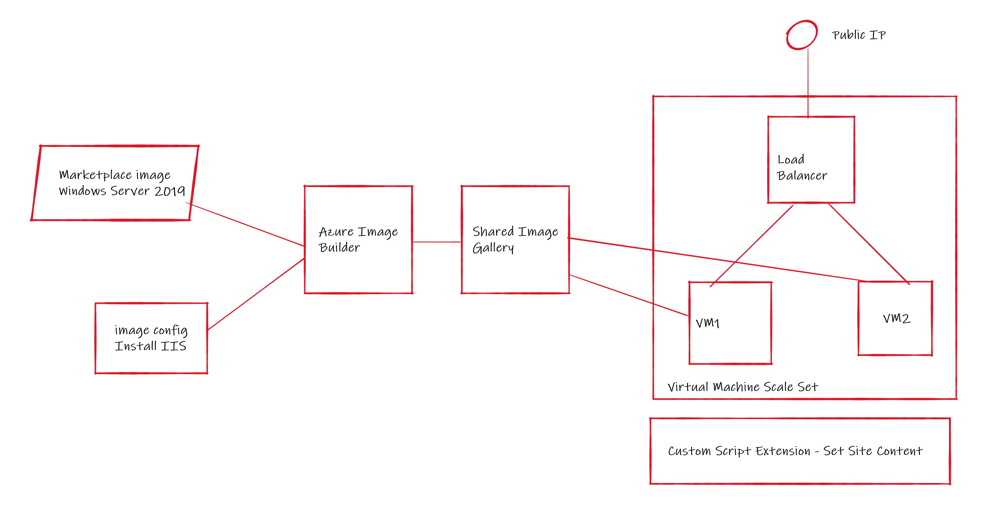

# Azure Image Builder with Virtual Machine Scale Sets demo
A set of bicep files that demostrate Azure Image Builder and VM Scale Sets working together

For the purposes of the demonstration AIB will take a marketplace Windows Server 2019 image and then add the IIS Roles and Features and then place the resulting image in a shared image gallery. Once the image has been successfully created a Virtual Machine Scale Set is then created from that image. 

We have also demonstrated how you can use a custom script extension on the scale set to perform post boot configuration on the vm.

